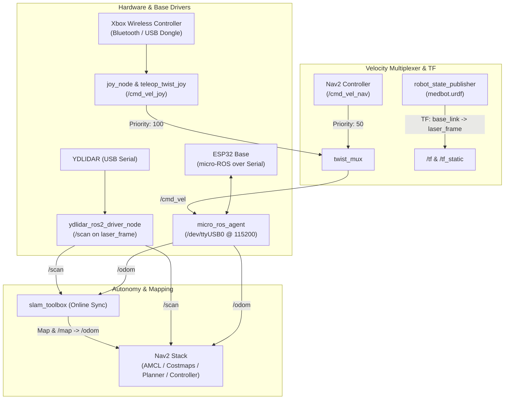

# ROS 2 Humble Setup & Configuration Guide for Medbot

This guide explains how to structure, build, and configure the ROS 2 Humble packages on your host PC or SBC (e.g., Raspberry Pi 4 / 5 or Jetson) to work seamlessly with the ESP32 micro-ROS firmware.

---

## 1. System Architecture & Flow



---

## 2. Workspace & Package Structure

Create a clean ROS 2 workspace on your host machine:

```bash
mkdir -p ~/medbot_ws/src
cd ~/medbot_ws/src
```

We recommend creating two clean packages:
1. `medbot_description`: URDF, meshes, and static TF definitions.
2. `medbot_bringup`: Launch files, parameter configs for Joy, `twist_mux`, LiDAR, SLAM, and Nav2.

Generate the packages:
```bash
ros2 pkg create --build-type ament_cmake medbot_description
ros2 pkg create --build-type ament_cmake medbot_bringup
```

Recommended directory layout:
```text
medbot_ws/
└── src/
    ├── medbot_description/
    │   ├── CMakeLists.txt
    │   ├── package.xml
    │   └── urdf/
    │       └── medbot.urdf.xacro
    └── medbot_bringup/
        ├── CMakeLists.txt
        ├── package.xml
        ├── config/
        │   ├── joy_params.yaml
        │   ├── twist_mux.yaml
        │   ├── ydlidar_params.yaml
        │   ├── mapper_params_online_sync.yaml
        │   └── nav2_params.yaml
        └── launch/
            ├── robot_bringup.launch.py
            ├── teleop.launch.py
            ├── slam.launch.py
            └── navigation.launch.py
```

---

## 3. Step-by-Step Package Configurations

### Step 3.1: Micro-ROS Agent Setup
Install and build the micro-ROS Agent on ROS 2 Humble:
```bash
cd ~/medbot_ws/src
git clone -b humble https://github.com/micro-ROS/micro_ros_setup.git
cd ~/medbot_ws
rosdep update && rosdep install --from-paths src --ignore-src -y
colcon build
source install/setup.bash

# Create & build agent step
ros2 run micro_ros_setup create_agent_ws.sh
ros2 run micro_ros_setup build_agent.sh
source install/setup.bash
```

To run the agent connecting to your ESP32:
```bash
ros2 run micro_ros_agent micro_ros_agent serial --dev /dev/ttyUSB0 -b 115200
```

---

### Step 3.2: Robot Description (URDF)
Create `medbot_description/urdf/medbot.urdf.xacro`:
```xml
<?xml version="1.0"?>
<robot xmlns:xacro="http://www.ros.org/wiki/xacro" name="medbot">

  <!-- Base Footprint (Ground Projection) -->
  <link name="base_footprint"/>

  <!-- Base Link (Chassis Center) -->
  <link name="base_link">
    <visual>
      <geometry>
        <box size="0.45 0.35 0.15"/>
      </geometry>
      <material name="blue">
        <color rgba="0.1 0.3 0.8 1.0"/>
      </material>
    </visual>
  </link>

  <joint name="base_footprint_joint" type="fixed">
    <parent link="base_footprint"/>
    <child link="base_link"/>
    <origin xyz="0 0 0.1143" rpy="0 0 0"/>
  </joint>

  <!-- YDLIDAR Link -->
  <link name="laser_frame">
    <visual>
      <geometry>
        <cylinder radius="0.035" length="0.04"/>
      </geometry>
      <material name="black">
        <color rgba="0.1 0.1 0.1 1.0"/>
      </material>
    </visual>
  </link>

  <joint name="laser_joint" type="fixed">
    <parent link="base_link"/>
    <child link="laser_frame"/>
    <!-- Position LiDAR (e.g. 15cm forward, 10cm above chassis) -->
    <origin xyz="0.15 0.0 0.12" rpy="0 0 0"/>
  </joint>

</robot>
```

---

### Step 3.3: Xbox Joystick & `twist_mux` Configuration

Install dependencies:
```bash
sudo apt-get install -y ros-humble-joy ros-humble-teleop-twist-joy ros-humble-twist-mux
```

#### `medbot_bringup/config/joy_params.yaml`:
```yaml
teleop_twist_joy_node:
  ros__parameters:
    axis_linear:
      x: 1                # Left stick vertical
    scale_linear:
      x: 0.5              # Max speed 0.5 m/s
    scale_linear_turbo:
      x: 1.0              # Turbo speed 1.0 m/s
    axis_angular:
      yaw: 3              # Right stick horizontal (or 0 for left stick horizontal)
    scale_angular:
      yaw: 1.2            # Max turn rate 1.2 rad/s
    enable_button: 4      # LB (Left Bumper) - Deadman switch
    enable_turbo_button: 5 # RB (Right Bumper) - Turbo switch
```

#### `medbot_bringup/config/twist_mux.yaml`:
```yaml
twist_mux:
  ros__parameters:
    topics:
      joystick:
        topic: /cmd_vel_joy
        timeout: 0.5
        priority: 100     # Highest Priority (Emergency Override & Manual Mapping)
      navigation:
        topic: /cmd_vel_nav
        timeout: 0.5
        priority: 50      # Nav2 Autonomous Commands
    locks:
      e_stop:
        topic: /e_stop
        timeout: 0.0
        priority: 255
```

---

### Step 3.4: YDLIDAR Integration
Install the YDLIDAR ROS 2 driver:
```bash
cd ~/medbot_ws/src
git clone https://github.com/YDLIDAR/ydlidar_ros2_driver.git
```
In `medbot_bringup/config/ydlidar_params.yaml`:
```yaml
ydlidar_ros2_driver_node:
  ros__parameters:
    port: /dev/ttyUSB1
    baudrate: 128000
    frame_id: laser_frame
    reversion: false
    auto_reconnect: true
    isSingleChannel: false
    intensity: false
    support_motor_dtr: true
    angle_min: -180.0
    angle_max: 180.0
    range_min: 0.12
    range_max: 12.0
```

---

### Step 3.5: Master Bringup Launch File
Create `medbot_bringup/launch/robot_bringup.launch.py`:
```python
import os
from ament_index_python.packages import get_package_share_directory
from launch import LaunchDescription
from launch_ros.actions import Node
import xacro

def generate_launch_description():
    pkg_description = get_package_share_directory('medbot_description')
    pkg_bringup = get_package_share_directory('medbot_bringup')

    # Process URDF
    xacro_file = os.path.join(pkg_description, 'urdf', 'medbot.urdf.xacro')
    robot_description_raw = xacro.process_file(xacro_file).toxml()

    # Robot State Publisher
    robot_state_publisher_node = Node(
        package='robot_state_publisher',
        executable='robot_state_publisher',
        output='screen',
        parameters=[{'robot_description': robot_description_raw, 'use_sim_time': False}]
    )

    # micro-ROS Agent
    micro_ros_agent = Node(
        package='micro_ros_agent',
        executable='micro_ros_agent',
        name='micro_ros_agent',
        arguments=['serial', '--dev', '/dev/ttyUSB0', '-b', '115200'],
        output='screen'
    )

    # Joy Node
    joy_node = Node(
        package='joy',
        executable='joy_node',
        name='joy_node',
        parameters=[{'autorepeat_rate': 20.0}]
    )

    # Teleop Twist Joy (publishes to /cmd_vel_joy)
    teleop_twist_joy_node = Node(
        package='teleop_twist_joy',
        executable='teleop_twist_joy_node',
        name='teleop_twist_joy_node',
        parameters=[os.path.join(pkg_bringup, 'config', 'joy_params.yaml')],
        remappings=[('/cmd_vel', '/cmd_vel_joy')]
    )

    # Twist Mux (multiplexes joy and nav2 to /cmd_vel)
    twist_mux_node = Node(
        package='twist_mux',
        executable='twist_mux',
        name='twist_mux',
        parameters=[os.path.join(pkg_bringup, 'config', 'twist_mux.yaml')],
        remappings=[('/cmd_vel_out', '/cmd_vel')]
    )

    # YDLIDAR Driver
    ydlidar_node = Node(
        package='ydlidar_ros2_driver',
        executable='ydlidar_ros2_driver_node',
        name='ydlidar_ros2_driver_node',
        parameters=[os.path.join(pkg_bringup, 'config', 'ydlidar_params.yaml')],
        output='screen'
    )

    return LaunchDescription([
        robot_state_publisher_node,
        micro_ros_agent,
        joy_node,
        teleop_twist_joy_node,
        twist_mux_node,
        ydlidar_node
    ])
```

---

## 4. SLAM Mapping & Nav2 Autonomy

### Step 4.1: SLAM Mapping Workflow
Install SLAM Toolbox:
```bash
sudo apt-get install -y ros-humble-slam-toolbox
```

Launch base robot and SLAM:
```bash
# Terminal 1: Launch Robot Base
ros2 launch medbot_bringup robot_bringup.launch.py

# Terminal 2: Launch SLAM Toolbox
ros2 launch slam_toolbox online_sync_launch.py

# Terminal 3: Launch RViz2
rviz2
```
* **Drive with Xbox Controller**: Hold `LB` and use the left stick to drive around the environment and map it.
* **Save the Map**:
  ```bash
  ros2 run nav2_map_server map_saver_cli -f ~/medbot_ws/maps/my_map
  ```

---

### Step 4.2: Nav2 Autonomous Navigation
Install Nav2:
```bash
sudo apt-get install -y ros-humble-navigation2 ros-humble-nav2-bringup
```

Launch Nav2 with the saved map:
```bash
ros2 launch nav2_bringup bringup_launch.py \
    use_sim_time:=False \
    map:=$HOME/medbot_ws/maps/my_map.yaml \
    params_file:=$HOME/medbot_ws/src/medbot_bringup/config/nav2_params.yaml
```

> [!NOTE]
> Remap the Nav2 velocity output from `/cmd_vel` to `/cmd_vel_nav` so `twist_mux` can prioritize manual Xbox control in emergencies.
