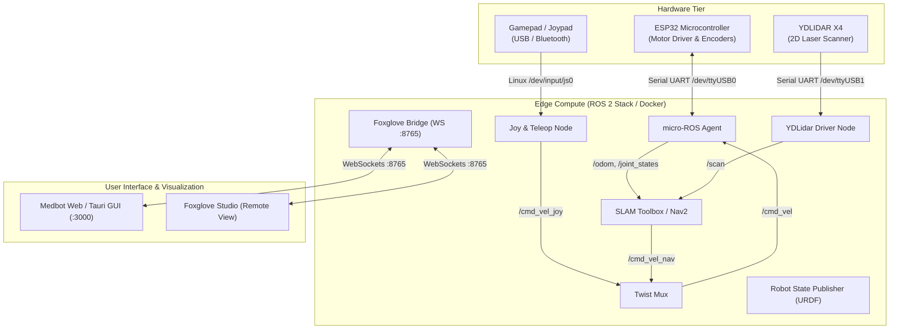
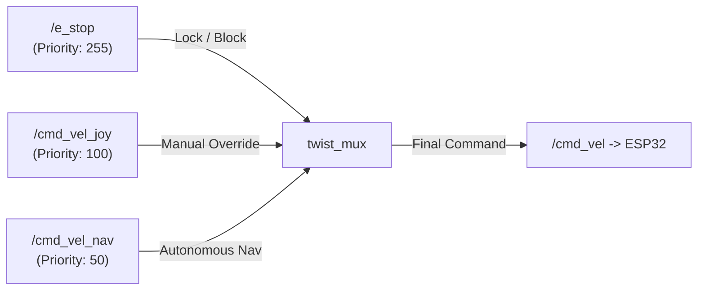

# 🏗️ Medbot Architecture & System Design

เอกสารอธิบายสถาปัตยกรรมระบบ โครงสร้างโฟลเดอร์ การไหลของข้อมูล (Data Flow) และการเชื่อมต่อระหว่างโมดูลทั้งหมดของหุ่นยนต์ Medbot

---

## 📑 สารบัญ

1. [ภาพรวมระบบ (System Overview)](#1-ภาพรวมระบบ-system-overview)
2. [โครงสร้างโปรเจกต์ (Project Directory Structure)](#2-โครงสร้างโปรเจกต์-project-directory-structure)
3. [สถาปัตยกรรมการสื่อสารและโหนด (Node & Topic Architecture)](#3-สถาปัตยกรรมการสื่อสารและโหนด-node--topic-architecture)
4. [โครงสร้างพิกัดและการแปลงแกน (TF Tree & Coordinate Frames)](#4-โครงสร้างพิกัดและการแปลงแกน-tf-tree--coordinate-frames)
5. [ระบบควบคุมความเร็ว (Velocity Control & Twist Mux)](#5-ระบบควบคุมความเร็ว-velocity-control--twist-mux)
6. [การพัฒนาและ Editor Workspaces (Development Workflow)](#6-การพัฒนาและ-editor-workspaces-development-workflow)

---

## 1. ภาพรวมระบบ (System Overview)

ระบบ Medbot ออกแบบในลักษณะ **Modular Multi-tier Architecture** ประกอบด้วย 3 ชั้นหลัก:



---

## 2. โครงสร้างโปรเจกต์ (Project Directory Structure)

โปรเจกต์จัดเก็บในรูปแบบ **Monorepo** โดยแบ่งหมวดหมู่ความรับผิดชอบอย่างชัดเจน:

```text
medbot/
├── firmware/                       # ⚡ [Firmware Tier] โค้ดไมโครคอนโทรลเลอร์ ESP32
│   └── drive_train_test/          # โครงการ PlatformIO สำหรับขับมอเตอร์และอ่าน Encoder
│       ├── platformio.ini         # ตั้งค่าบอร์ด, ไลบรารี และ micro-ROS
│       ├── include/               # Header files (PID, Kinematics, Motor, Encoder)
│       └── src/                   # Source files & main.cpp
│
├── ros/                            # 🤖 [ROS 2 Tier] ซอฟต์แวร์หุ่นยนต์และ Docker
│   ├── Dockerfile                 # Multi-stage Dockerfile (Base, Dev, Prod)
│   ├── entrypoint.sh              # Runtime environment loader (/opt/ros, /opt/uros_ws)
│   └── workspace/                 # ROS 2 Colcon Workspace
│       └── src/
│           ├── medbot_bringup/    # Launch files, Parameters (Nav2, SLAM, Joy, Twist Mux)
│           ├── medbot_description/# URDF/Xacro 3D model และ TF definitions
│           └── ydlidar_ros2_driver/# ไดรเวอร์เชื่อมต่อ 2D LiDAR
│
├── gui/                            # 💻 [Frontend Tier] ส่วนติดต่อผู้ใช้
│   ├── Dockerfile                 # Standalone web GUI container
│   ├── src-tauri/                 # Tauri Desktop Framework (Rust Backend)
│   ├── src/                       # Next.js / React Web Application
│   └── package.json
│
├── docs/                           # 📚 [Documentation] เอกสารระบบและคู่มือแก้ปัญหา
│   ├── ARCHITECTURE.md            # เอกสารสถาปัตยกรรมระบบ (ไฟล์นี้)
│   └── TROUBLESHOOTING.md         # รวบรวมปัญหาและวิธีแก้ไขทั้งหมด
│
├── .devcontainer/                  # 🐳 [Dev Tools] VS Code Container Environment
│   └── devcontainer.json          # ต่อเข้า Container เพื่อพัฒนา ROS 2 สะดวก
├── robot.code-workspace           # 🛠️ [VS Code Multi-root Workspace] สำหรับพัฒนา GUI & Firmware
├── docker-compose.yml              # Process Orchestration สำหรับรัน Robot Stack & GUI
└── Makefile                        # Shortcut commands (make up, make logs, make colcon)
```

---

## 3. สถาปัตยกรรมการสื่อสารและโหนด (Node & Topic Architecture)

### ตาราง ROS 2 Topics สำคัญ

| Topic | Message Type | Publisher | Subscriber | คำอธิบาย |
| :--- | :--- | :--- | :--- | :--- |
| `/cmd_vel` | `geometry_msgs/msg/Twist` | `twist_mux` | `micro_ros_agent` (ESP32) | คำสั่งความเร็วรวมที่ส่งไปขับเคลื่อนล้อ |
| `/cmd_vel_joy` | `geometry_msgs/msg/Twist` | `teleop_node` | `twist_mux` | คำสั่งความเร็วจากจอยสติ๊ก (Manual Mode) |
| `/cmd_vel_nav` | `geometry_msgs/msg/Twist` | `nav2_controller` | `twist_mux` | คำสั่งความเร็วจากการนำทางอัตโนมัติ (Autonomous Mode) |
| `/scan` | `sensor_msgs/msg/LaserScan` | `ydlidar_ros2_driver_node`| `slam_toolbox`, `nav2` | ข้อมูลระยะตรวจจับ 2D Laser Scan |
| `/tf`, `/tf_static` | `tf2_msgs/msg/TFMessage` | `robot_state_publisher`, `slam` | ทุกโหนด | พิกัดการแปลงแกนและตำแหน่งของชิ้นส่วนหุ่นยนต์ |
| `/joy` | `sensor_msgs/msg/Joy` | `joy_node` | `teleop_node` | สัญญาณดิบของการกดปุ่มและแกนอนาล็อก |
| `/e_stop` | `std_msgs/msg/Bool` | UI / Foxglove / E-Stop | `twist_mux` | คำสั่งหยุดฉุกเฉินระดับสูงสุด (Priority 255) |

---

## 4. โครงสร้างพิกัดและการแปลงแกน (TF Tree & Coordinate Frames)

โครงสร้าง Frame ของ Medbot อ้างอิงตามมาตรฐาน [REP 105](https://www.ros.org/reps/rep-0105.html):

```mermaid
graph TD
    map["map (Global Map Frame)"]
    odom["odom (Odometry Frame)"]
    base_footprint["base_footprint (Ground Projection)"]
    base_link["base_link (Robot Chassis Center)"]
    laser_frame["laser_frame (YDLIDAR Sensor)"]

    map -->|SLAM Toolbox / AMCL| odom
    odom -->|Wheel Odometry / EKF| base_footprint
    base_footprint -->|Fixed Joint (Height 0.1143m)| base_link
    base_link -->|Fixed Joint (X: 0.15m, Z: 0.12m)| laser_frame
```

---

## 5. ระบบควบคุมความเร็ว (Velocity Control & Twist Mux)

Medbot ใช้ **`twist_mux`** ในการจัดลำดับความสำคัญ (Priority) ของคำสั่งควบคุมความเร็ว ป้องกันไม่ให้คำสั่งชนกันระหว่างโหมด Manual และ Auto:



* **Priority 255 (E-Stop):** หากเปิดสัญญาณ E-Stop คำสั่งทั้งหมดจะถูกตัดทันที
* **Priority 100 (Joypad):** เมื่อผู้ใช้กดปุ่ม **LB (Deadman)** และโยกจอย คำสั่ง Manual จะแย่งการควบคุมจาก Nav2 ทันที เพื่อความปลอดภัย
* **Priority 50 (Nav2 Navigation):** ทำงานเมื่อไม่มีคำสั่งจากจอยสติ๊กเข้ามาภายใน 0.5 วินาที

---

## 6. การพัฒนาและ Editor Workspaces (Development Workflow)

### 1) พัฒนา ROS 2 ภายใน Docker (Dev Container)
* เปิด VS Code แล้วเลือก **`Dev Containers: Reopen in Container`**
* ระบบจะเปิดไฟล์ในคอนเทนเนอร์และเชื่อมต่อ ROS 2 Humble Environment ให้อัตโนมัติ

### 2) พัฒนา GUI และ Firmware บนเครื่อง Local
* เปิดไฟล์ [robot.code-workspace](file:///Users/porto/Workspace/Sandbox/medbotv2/robot/robot.code-workspace)
* มี PlatformIO IDE รองรับการ Flash ESP32 และ Prettier/Tailwind สำหรับเขียนหน้าเว็บ Next.js

---

## 7. คำสั่งลัดที่สำคัญ (Makefile Quick Reference)

| คำสั่ง | การทำงาน |
| :--- | :--- |
| `make up` | สตาร์ตระบบหุ่นยนต์ทั้งหมดใน Background |
| `make down` | หยุดการทำงานของ Container ทั้งหมด |
| `make logs` | ดู Log การทำงานของระบบหุ่นยนต์แบบ Real-time |
| `make build` | Rebuild Docker Image ใหม่ |
| `make colcon` | สั่ง `colcon build` ภายใน Container ที่กำลังรันอยู่ |
| `make shell` | เปิด Bash Shell เข้าไปใน Robot Container |
| `make gui` | เปิดใช้งาน Web GUI Service (`http://localhost:3000`) |
